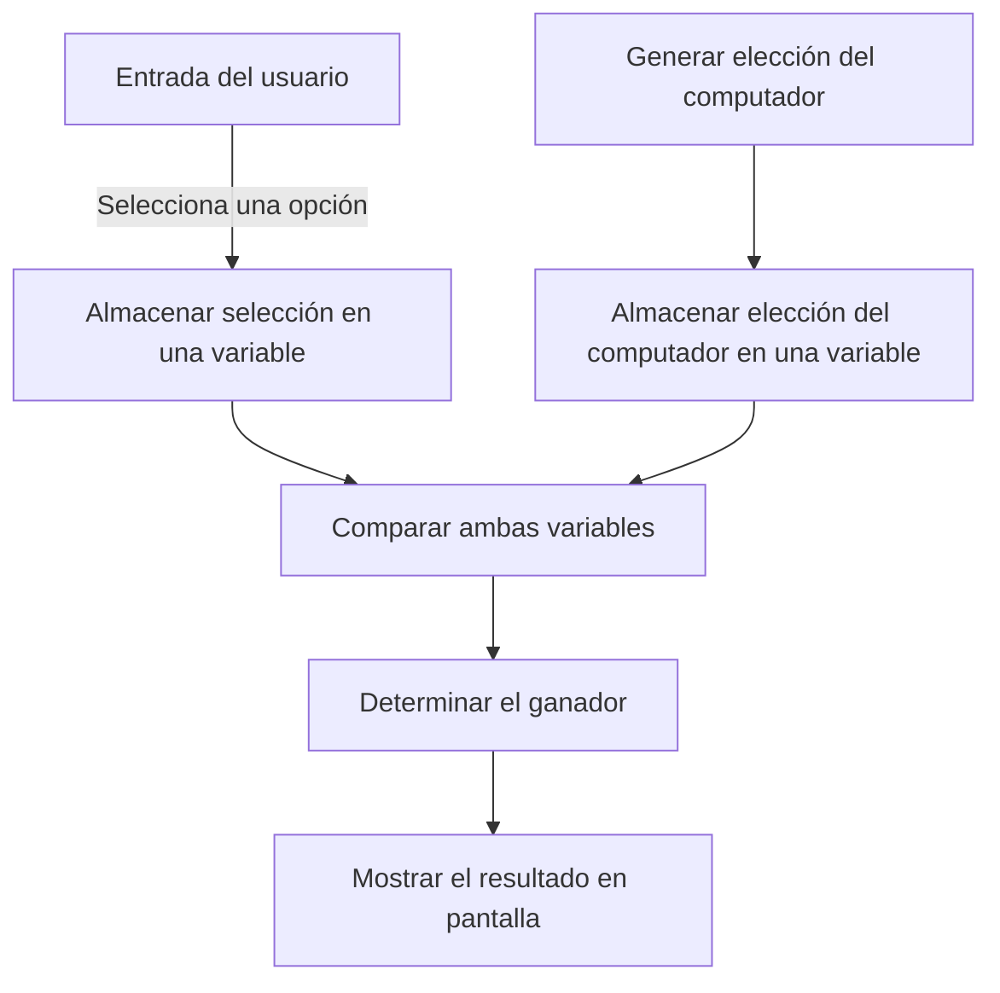

# 📘 Laboratorio 02: Piedra, papel y tijeras 🚽✂️📄

## Plataformas Software Móviles (PSM)

Estas guías de laboratorio han sido elaboradas por:

 **Diego Martín de Andrés** 
 
 Para la asignatura **Plataformas Software Móviles (PSM)** 
 
---

### 📌 Nota

Ante cualquier error o sugerencia, por favor, contáctame en mi correo: [diego.martin.andres@uva.es](mailto:diego.martin.andres@uva.es) 📧.

## 📝 Tabla de contenidos

- [📘 Laboratorio 02: Piedra, papel y tijeras 🚽✂️📄](#-laboratorio-02-piedra-papel-y-tijeras-️)
  - [Plataformas Software Móviles (PSM)](#plataformas-software-móviles-psm)
  - [📝 Tabla de contenidos](#-tabla-de-contenidos)
- [Introducción al juego "Piedra, Papel o Tijeras" 🚽✂️📄](#introducción-al-juego-piedra-papel-o-tijeras-️)
  - [Introducción](#introducción)
  - [1. ¿Qué necesitamos para construir el juego? 🤔](#1-qué-necesitamos-para-construir-el-juego-)
  - [2. Flujo de información 🧠](#2-flujo-de-información-)
  - [3. Tipos de datos que usaremos 📝](#3-tipos-de-datos-que-usaremos-)
  - [4. Condiciones lógicas 🧩](#4-condiciones-lógicas-)
- [Entrada de Datos del Usuario y Condicionales en Kotlin 🎮](#entrada-de-datos-del-usuario-y-condicionales-en-kotlin-)
  - [Entrada de datos con `readLine()` 🖥️](#entrada-de-datos-con-readline-️)
  - [Comparar la entrada con condicionales](#comparar-la-entrada-con-condicionales)
  - [Tratamiento de Errores 🛑](#tratamiento-de-errores-)
- [Aplicación de Piedra, Papel o Tijeras en Kotlin 🕹️](#aplicación-de-piedra-papel-o-tijeras-en-kotlin-️)
  - [Paso 1: Crear y preparar el proyecto 🚀](#paso-1-crear-y-preparar-el-proyecto-)
  - [Paso 2: Inicializar las variables 🌱](#paso-2-inicializar-las-variables-)
  - [Paso 3: Obtener elección del jugador 🎮](#paso-3-obtener-elección-del-jugador-)
- [¿Pero qué es `?:`?](#pero-qué-es-)
  - [Sintaxis](#sintaxis)
  - [Ejemplos](#ejemplos)
  - [Comparación con otras soluciones](#comparación-con-otras-soluciones)
  - [Uso práctico](#uso-práctico)
  - [Resumen](#resumen)
  - [Paso 4: Elección aleatoria de la computadora 🎲](#paso-4-elección-aleatoria-de-la-computadora-)
  - [Paso 5: Lógica de comparación ⚔️](#paso-5-lógica-de-comparación-️)
- [Continuando con la aplicación de Piedra, Papel o Tijeras 🚽 📄 ✂️](#continuando-con-la-aplicación-de-piedra-papel-o-tijeras---️)
  - [Paso 1: Reemplazar `if` por `when` 💡](#paso-1-reemplazar-if-por-when-)
  - [Paso 2: Comparar las elecciones ⚖️](#paso-2-comparar-las-elecciones-️)
  - [Paso 3: Mostrar el resultado 🏆](#paso-3-mostrar-el-resultado-)
  - [Tip:](#tip)
- [Finalizando la aplicación de Piedra, Papel o Tijeras 🚽✂️📄](#finalizando-la-aplicación-de-piedra-papel-o-tijeras-️)
  - [Lógica para determinar el ganador 🏆](#lógica-para-determinar-el-ganador-)
  - [Simplificación con plantillas de cadenas 💡](#simplificación-con-plantillas-de-cadenas-)
- [Sentencias While en Kotlin 🔄](#sentencias-while-en-kotlin-)
  - [Ejemplo básico de While con un contador 🧮](#ejemplo-básico-de-while-con-un-contador-)
  - [Consideraciones sobre bucles infinitos ⚠️](#consideraciones-sobre-bucles-infinitos-️)

---

# Introducción al juego "Piedra, Papel o Tijeras" 🚽✂️📄
(Es cierto, no es una piedra, pero es un inodoro y estos pero suelen ser Roca que es lo más parecido a una piedra 😂)

## Introducción
Vamos a programar el juego **Piedra, Papel o Tijeras** en Kotlin. Antes de adentrarnos en los detalles de cómo progamar la aplicación, vamos a reflexionar en términos generales sobre lo que necesitamos.

---

## 1. ¿Qué necesitamos para construir el juego? 🤔

Para crear este juego, necesitamos entender lo siguiente:

- **Nuestra elección**: Saber qué opción eligió el usuario (piedra, papel o tijeras).
- **Elección del computador**: Saber qué opción eligió el algoritmo.
- **Comparación**: Con los dos datos anteriores, ya podemos comparar ambas elecciones para determinar el ganador.

---

## 2. Flujo de información 🧠

Por lo tanto el flujo de información es sencillo:

- **Entrada del usuario**: Necesitamos almacenar en una variable lo que el jugador ha seleccionado.
- **Elección del computador**: Necesitamos generar la elección del computador y almacenarlo en una variable.
- **Comparación de elecciones**: Comparando ambas variables se puede determinar el ganador y mostrarlo en pantalla.



---

## 3. Tipos de datos que usaremos 📝

Veremos tres tipos de datos clave:

- **Número (`Int`)**: Para almacenar valores numéricos.
- **Texto (`String`)**: Para almacenar cadenas de texto.
- **Booleano (`Boolean`)**: Para almacenar verdadero o falso, útil para trabajar con condiciones.

---

## 4. Condiciones lógicas 🧩

El juego depende de condiciones. Por ejemplo:

- Si elegimos tijeras (opción 1) y la computadora elige piedra (opción 2), entonces piedra gana.
- Usaremos condiciones para comparar las elecciones y decidir el resultado.

---

# Entrada de Datos del Usuario y Condicionales en Kotlin 🎮

## Entrada de datos con `readLine()` 🖥️

Para solicitar la entrada de datos al usuario, utilizamos `readLine()`. Este método obtiene la entrada como una cadena (String). Si necesitamos convertirlo a otro tipo, por ejemplo, un entero (Int), usamos `.toInt()`:

``` Kotlin
println("Introduce tu edad:")
val edad = readLine().toInt()
```

También se puede realizar por partes si lo entiendes mejor. Piensa que aunque nos introduzcan "24" en realidad es un String y hay que convertirlo a un número para poder trabajar con el con una sentencia `if..else`.
    
``` Kotlin
println("Introduce tu edad:")
val entrada = readLine()
// Entrada es un String, en la siguiente instrucción lo convertimos a Int
val edad = entrada.toInt()
```

## Comparar la entrada con condicionales

Podemos aplicar condicionales **if-else** para actuar según la entrada del usuario:

``` Kotlin
if (edad >= 18) {
    println("Puedes entrar al club")
} else {
    println("Eres demasiado joven")
}
```

## Tratamiento de Errores 🛑
Si el usuario introduce un valor no numérico, se producirá una **java.lang.NumberFormatException**. ¡Hay que tener cuidado con los tipos!

Obviamente esto se puede capturar con un bloque `try-catch` como se hace en Java. Aunque es algo que veremos más adelante.

``` Kotlin
fun main() {
    try {
        val input = readLine()
        val edad = input?.toIntOrNull()

        if (edad != null) {
            println("Tu edad es $edad")
        } else {
            println("Por favor, introduce un número válido")
        }
    } catch (e: NumberFormatException) {
        println("Por favor, introduce un número")
    }
}
```

Ya explicaremos con más detalle el bloque `try-catch` y el operador seguro `?`.

# Aplicación de Piedra, Papel o Tijeras en Kotlin 🕹️

Vamos a desarrollar un sencillo juego de **Piedra, Papel o Tijeras** utilizando Kotlin. En una primera fase implementaremos únicamente la lógica del juego y comprobaremos su funcionamiento mediante la consola de Android Studio, sin utilizar todavía una interfaz gráfica.

> **Importante:** en esta primera parte de la práctica no será necesario utilizar un emulador ni un dispositivo Android. El código se ejecutará directamente en nuestro ordenador y los resultados se mostrarán en la consola de Android Studio.

## Paso 1: Crear y preparar el proyecto 🚀

### 1.1. Crear un nuevo proyecto

1. Abre **Android Studio** y selecciona **New Project**.
2. Selecciona la plantilla **No Activity**.
3. Configura el proyecto con los siguientes datos:
   - **Name:** `RockPaperScissors`
   - **Package name:** `es.uva.inf5g.psm.rockpaperscissors`
   - **Language:** `Kotlin`
   - **Minimum SDK:** `API 24`
4. Pulsa **Finish** y espera a que Android Studio termine de crear y sincronizar el proyecto.

Al seleccionar **No Activity**, el proyecto Android se crea sin ninguna pantalla ni interfaz gráfica inicial.

### 1.2. Crear un módulo para ejecutar Kotlin desde la consola

El módulo `app` que se crea automáticamente está pensado para desarrollar aplicaciones Android. Para poder ejecutar directamente código Kotlin mediante una función `main()`, vamos a crear un módulo adicional de tipo **Java or Kotlin Library**.

1. Selecciona **File → New → New Module...**
2. En la ventana **Create New Module**, selecciona **Java or Kotlin Library**.
3. Configura el nuevo módulo con los siguientes datos:
   - **Library name:** `game`
   - **Package name:** `es.uva.inf5g.psm.rockpaperscissors`
   - **Class name:** `RockPaperScissors`
   - **Language:** `Kotlin`
4. Pulsa **Finish** y espera a que Android Studio sincronice nuevamente el proyecto.

El proyecto tendrá ahora dos módulos principales:

```text
RockPaperScissors
├── app       ← Aplicación Android
└── game      ← Código Kotlin ejecutable desde la consola
```

Por el momento trabajaremos únicamente con el módulo `game`. Más adelante utilizaremos el módulo `app` para desarrollar la interfaz de la aplicación Android si quisiéramos.

### 1.3. Localizar el fichero `RockPaperScissors.kt`

Android Studio habrá creado automáticamente el fichero `RockPaperScissors.kt`. Puedes encontrarlo en:

```text
game
└── src
    └── main
        └── kotlin
            └── es.uva.inf5g.psm.rockpaperscissors
                └── RockPaperScissors.kt
```

Abre el fichero `RockPaperScissors.kt` y elimina el código que Android Studio haya generado automáticamente.

### 1.4. Crear la función `main()`

Añade el siguiente código al fichero `RockPaperScissors.kt`:

```kotlin
package es.uva.inf5g.psm.rockpaperscissors

fun main() {
    println("Piedra, Papel o Tijeras")
}
```

La función `main()` será el punto de entrada de nuestro programa y la utilizaremos para probar la lógica del juego.

### 1.5. Ejecutar el programa

Android Studio mostrará un icono ▶️ junto a la función `main()`.

1. Pulsa sobre el icono ▶️.
2. Selecciona **Run 'RockPaperScissorsKt'**.
3. Observa la ventana **Run** situada en la parte inferior de Android Studio.

Deberá aparecer:

```text
Piedra, Papel o Tijeras
```

A partir de este momento iremos implementando la lógica del juego en Kotlin y utilizaremos la función `main()` para comprobar su funcionamiento.


## Paso 2: Inicializar las variables 🌱

Define las variables iniciales para las elecciones del jugador y la computadora.

``` Kotlin
var computerChoice: String = ""
var playerChoice: String = ""
```

## Paso 3: Obtener elección del jugador 🎮

Solicita al jugador que ingrese su elección (piedra, papel o tijeras).

``` Kotlin
println("Piedra, Papel o Tijeras: Ingrese su elección")
playerChoice = readln() ?: ""
```

---

# ¿Pero qué es `?:`?

Es el operador **Elvis**. Si, si, como el rey del rock. 🕺


El operador **Elvis** (`?:`) en Kotlin es un operador que se utiliza para proporcionar un **valor predeterminado** en caso de que la expresión a su izquierda sea `null`. Este operador es muy útil cuando trabajas con variables o expresiones que pueden contener valores nulos, ya que permite asignar un valor alternativo cuando se encuentra un valor `null`, evitando así excepciones de tipo `NullPointerException`.

## Sintaxis

``` Kotlin
val resultado = expresion ?: valorPredeterminado
```

- **expresion**: Puede ser cualquier valor o expresión que potencialmente podría ser `null`.
- **valorPredeterminado**: El valor que se utilizará si la **expresion** es `null`.

### Funcionamiento

- Si la **expresion** no es `null`, su valor se asigna a la variable.
- Si la **expresion** es `null`, el **valorPredeterminado** se asigna a la variable.

## Ejemplos

### Ejemplo básico

``` Kotlin
val nombre: String? = null
val nombreDefinitivo = nombre ?: "Desconocido"
println(nombreDefinitivo) // Imprime "Desconocido"
```

OJO! Si te fijas en la declaración de la variable `nombre`, tiene un signo de interrogación (`?`) al final. Esto indica que `nombre` puede ser `null`. De otra manera, Kotlin lanzaría un error de compilación.

Prueba con el siguiente código:

``` Kotlin
val nombre: String = null
val nombreDefinitivo = nombre ?: "Desconocido"
println(nombreDefinitivo) // Imprime "Desconocido"
```

En este ejemplo, como `nombre` es `null`, el operador Elvis asigna `"Desconocido"` a `nombreDefinitivo`.

### Ejemplo con `readLine()`

El operador Elvis es útil para manejar entradas que podrían ser `null`:

``` Kotlin
val userInput = readLine() ?: "Entrada vacía"
println(userInput) // Si el usuario no introduce nada, imprime "Entrada vacía"
```

Aquí, si el usuario no introduce ningún valor (y `readLine()` devuelve `null`), el programa asigna `"Entrada vacía"` en su lugar.

## Comparación con otras soluciones

Sin el operador Elvis, necesitarías escribir un bloque `if` para realizar la misma operación:

``` Kotlin
val nombre: String? = null
val nombreDefinitivo = if (nombre != null) nombre else "Desconocido"
```

El operador Elvis proporciona una forma más compacta y legible de hacer lo mismo.

## Uso práctico

El operador Elvis es muy útil cuando trabajas con variables que pueden ser `null`, ya que permite asignar un valor predeterminado rápidamente. Esto es particularmente útil en las siguientes situaciones:

- Al manejar la entrada del usuario.
- Cuando trabajas con valores opcionales en bases de datos o respuestas de API.
- En cualquier caso donde una variable puede ser `null` y quieras asegurarte de que nunca será asignada como tal.

## Resumen

El operador Elvis (`?:`) en Kotlin es una forma simple y elegante de manejar valores nulos. Te permite proporcionar valores predeterminados para evitar errores comunes como las excepciones `NullPointerException`, haciendo que tu código sea más seguro y legible.

### Otros modificadores de Variables en Kotlin

En Kotlin, existen varios modificadores que se pueden aplicar a las variables para controlar su comportamiento y características. A continuación, se explican algunos de los más importantes:

1. **Nullable Types (`?`)** 🤔
   - Para que una variable pueda contener `null`, debes añadir un signo de interrogación (`?`) al tipo de la variable. Esto le permite aceptar valores `null`, lo cual no es permitido por defecto en Kotlin.

   Ejemplo:

   ```kotlin
   val nombreAnulable: String? = null  // Esta variable puede ser null
   ```

2. **`lateinit`** ⏳
   - Este modificador se utiliza para declarar variables mutables (`var`) que se inicializarán más tarde. Solo se puede usar con tipos no anulables. Es útil cuando no puedes inicializar la variable inmediatamente, pero garantizas que lo harás antes de usarla.

   Ejemplo:

   ```kotlin
   lateinit var apellido: String

   fun inicializar() {
       apellido = "Martín"
   }
   ```

3. **`val` vs `var`** 🔄
   - **`val`**: Indica que la variable es inmutable. Una vez asignado un valor, no puede cambiarse.
   - **`var`**: Indica que la variable es mutable, lo que significa que su valor puede cambiar.

   Ejemplo:

   ```kotlin
   val nombreFijo: String = "Enrique"  // No se puede cambiar
   var nombreCambiante: String = "Bea"  // Se puede cambiar
   nombreCambiante = "Isma"
   ```

4. **`const`** 📐
   - El modificador `const` se utiliza para definir **constantes de tiempo de compilación**. Solo se puede usar con variables de nivel superior o propiedades de objetos (`object`). Siempre debe ser un `val`.

   Ejemplo:

   ```kotlin
   const val PI = 3.14159
   ```
   - `val` vs `const val` 
       - `val` → inmutable, pero su valor se determina en **runtime**.
       -  `const val` → inmutable, y su valor está disponible en **compile-time**.

    Ejemplo:

    ```kotlin
    val today = LocalDate.now()     // ✅ permitido
    const val todayConst = LocalDate.now() // ❌ ERROR: no es constante de compilación
    ```


5. **`by lazy`** 💤
   - `by lazy` se utiliza para inicialización perezosa. Esto significa que la variable se inicializa solo cuando es accedida por primera vez. Solo se puede usar con variables inmutables (`val`).

   Ejemplo:

   ```kotlin
   val valorPerezoso by lazy {
       "Este valor se genera al acceder"
   }
   ```

6. **`vararg`** ➕
   - `vararg` permite que una función reciba un número variable de argumentos del mismo tipo. Pueden ser 0 o muchos argumentos.

   Ejemplo:

   ```kotlin
    fun sumar(vararg numeros: Int): Int {
        return numeros.sum()   // puedes usar operaciones de Array/Collection
    }

    fun main() {
        println(sumar(1, 2, 3, 4)) // 10
    }   
    ```
   
    ### Cosas clave

    * ✔️ `vararg` se **trata como un `Array<T>`** dentro de la función.
    * ✔️ Puedes usar `.size` para conocer su tamaño.
    * ✔️ Puedes acceder a un elemento con el índice: `nombres[i]`.
    * ✔️ Puedes recorrerlo con `for` o con funciones de colección como `map`, `filter`, etc.


7. **`data class`** 📝
   - Aunque no es un modificador de variables, las **clases de datos** (`data class`) en Kotlin generan automáticamente métodos `getters` y `setters` y otros métodos como `copy()`, `toString()`, `equals()`, para simplificar el manejo de clases con datos.

   Ejemplo:

   ```kotlin
   data class Persona(val nombre: String, var edad: Int)
   ```

    ### Accesores (getters y setters) de un `data class`

    - **Si usas `val`** → se genera un **getter** automático (lectura) pero **no un setter** (es inmutable).
    - **Si usas `var`** → se generan **getter y setter** (lectura y modificación).
    - En el ejemplo anterior, `nombre` es inmutable (solo lectura) y `edad` es mutable (lectura y escritura).


8. **Operador de Aserción de No Nulo (`!!`) en Kotlin**

- En Kotlin, el operador `!!` se llama **operador de aserción de no nulo** ("non-null assertion operator"). Este operador indica al compilador que confíes en que una variable anulable **no es `null`** en ese momento, y que puedes tratarla como una variable no anulable.

- Cuando usas `!!`, le estás diciendo al compilador: "Estoy seguro de que esta variable no es `null`, así que deja de advertirme sobre su posible nulabilidad". Si el valor resulta ser `null`, Kotlin lanzará una excepción `NullPointerException` (NPE) en tiempo de ejecución.

### Ejemplo:

   ```kotlin
   val variableNoNula: String = variablePosiblementeNula!!
   ```

- `variablePosiblementeNula` es de un tipo anulable (`String?`), lo que significa que podría contener `null`.
- Al usar `variablePosiblementeNula!!`, estás diciendo: "Confío en que `variablePosiblementeNula` **no es `null`**, así que lo trato como un `String` no anulable".

- Si `variablePosiblementeNula` fuera `null` en este momento, se lanzaría una excepción.

### Uso recomendado

- Es importante usar `!!` con cautela, porque si no estás completamente seguro de que el valor no es `null`, puedes acabar con una excepción `NullPointerException`, algo que Kotlin intenta evitar de forma nativa. En la mayoría de los casos, es preferible manejar la nulabilidad de forma segura con el operador **Elvis** (`?:`), el operador **safe call** (`?.`), o una comprobación explícita de `null`.

### Ejemplo usando alternativas seguras:

- Usando el operador **Elvis**:

```kotlin
val variableNoNula: String = variablePosiblementeNula ?: "Valor por defecto"
```

- Usando el operador **safe call**:

```kotlin
variablePosiblementeNula?.let {
    // Esto se ejecuta solo si variablePosiblementeNula no es null
}
```

### Resumen:
El operador `!!` fuerza a Kotlin a tratar una variable como no nula, pero si esa variable es `null` en tiempo de ejecución, se lanzará una `NullPointerException`. Es una herramienta poderosa, pero debes usarla con cuidado para evitar errores inesperados.

---

## Paso 4: Elección aleatoria de la computadora 🎲

Generamos una elección aleatoria para la computadora usando números aleatorios.

``` Kotlin
val randomNumber = (1..3).random()

if (randomNumber == 1) {
    computerChoice = "piedra"
} else if (randomNumber == 2) {
    computerChoice = "papel"
} else {
    computerChoice = "tijeras"
}

println("Elección de la computadora: $computerChoice")
```

### Reto:
¿Serías capaz de hacerlo con una sentencia `when` sin utilizar una `IA`?

## Paso 5: Lógica de comparación ⚔️

Compara la elección del jugador con la de la computadora para determinar el resultado.

### Reto 
¿Serías capaz de hacer el código tu solo? Prueba a hacerlo, pero si te atascas, aquí tienes una posible solución.

### Solución
<details>
  <summary>Haz clic para ver el código</summary>


Espero que no hayas sido un gallina 🐔
y lo hayas intentado por ti mismo. Aquí tienes la solución:


``` Kotlin
if (playerChoice == computerChoice) {
    println("Es un empate!")
} else if ((playerChoice == "piedra" && computerChoice == "tijeras") ||
           (playerChoice == "papel" && computerChoice == "piedra") ||
           (playerChoice == "tijeras" && computerChoice == "papel")) {
    println("¡Ganaste!")
} else {
    println("La computadora gana.")
}
```
</details>

---


 # Continuando con la aplicación de Piedra, Papel o Tijeras 🚽 📄 ✂️

Vamos a seguir desarrollando la aplicación de **Piedra, Papel o Tijeras**. Vamos a reemplazar el código usando sentencias `when`.

## Paso 1: Reemplazar `if` por `when` 💡

Primero, reemplazaremos las sentencias `if` por `when` para optimizar el código. Para cuando se genere la elección de la computadora.

Piénsalo un poco antes de ver la solución.


<details>
  <summary>Haz clic para ver el código</summary>


``` Kotlin
val randomNumber = (1..3).random()
val computerChoice = when (randomNumber) {
    1 -> "piedra"
    2 -> "papel"
    3 -> "tijeras"
}
```
</details>

## Paso 2: Comparar las elecciones ⚖️

Ahora vamos a comparar las elecciones de la computadora y el jugador usando `when`. 

¿Serías capaz de hacerlo por ti mismo?

<details>
  <summary>Haz clic para ver el código</summary>

``` Kotlin
val winner = when {
    playerChoice == computerChoice -> "empate"
    playerChoice == "piedra" && computerChoice == "tijeras" -> "jugador"
    playerChoice == "papel" && computerChoice == "piedra" -> "jugador"
    playerChoice == "tijeras" && computerChoice == "papel" -> "jugador"
    else -> "computador"
}
```
</details>

## Paso 3: Mostrar el resultado 🏆

Finalmente, mostramos el ganador de la partida.

``` Kotlin
println("La elección de la computadora fue: $computerChoice")
println("El ganador es: $winner")
```

## Tip:


<details>
  <summary>Pulsa para ver el tip, pero antes prueba por ti mismo resolverlo con las sentencias `when`</summary>


Puedes pedirle a **Android Studio** que reemplace automáticamente las sentencias `if` por `when`. Colócate encima del `if` y se abrirá un pequeño menú contextual. Selecciona **Replace 'if' with 'when'** y listo.

</details>

---

 
# Finalizando la aplicación de Piedra, Papel o Tijeras 🚽✂️📄


## Lógica para determinar el ganador 🏆

Vamos a utilizar una estructura `if-else` para determinar si fue un empate, ganó el jugador o la computadora.

``` Kotlin
if (winner == "empate") {
    println("Es un empate")
} else if (winner == "jugador") {
    println("El jugador ganó")
} else {
    println("La computadora ganó")
}
```

## Simplificación con plantillas de cadenas 💡

Podemos simplificar el código utilizando **plantillas de cadenas** en lugar de concatenación de cadenas.

``` Kotlin
if (winner == "empate") {
    println("Es un empate")
} else {
    println("El $winner ganó")
}
```
### Nota:
Si pusiste `computador` entonces no tendrás problema con el artículo `el`. Pero si pusiste `computadora` tendrás que cambiar el código.


 
# Sentencias While en Kotlin 🔄

En este ejercicio aprenderemos a utilizar bucles **while** en Kotlin. Un bucle while ejecuta un bloque de código repetidamente mientras una condición sea verdadera.

## Ejemplo básico de While con un contador 🧮

``` Kotlin
var count = 0

while (count < 3) {
    println("Count es $count")
    count++
}

println("El bucle ha terminado")
```

### Explicación
1. El código imprime el valor de `count` mientras sea menor que 3.
2. Cada iteración incrementa el valor de `count` en 1.
3. El bucle se detiene cuando `count` ya no es menor que 3.

## Consideraciones sobre bucles infinitos ⚠️

Nunca escribas un bucle sin una condición que pueda volverse falsa, como:

``` Kotlin
while (true) { /* Esto causará un bucle infinito */ }
```

### Retos
1. Modifica el código para que el bucle se ejecute 5 veces.
2. Modifica el código para que el bucle se ejecute infinitamente. ¿Sabrías parar la ejecución?
3. Modifica el código para que después de cada partida, te pregunte si quieres seguir jugando. Si introduces "s" seguirá jugando, si introduces "n" se detendrá.


