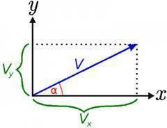

# Reto Labo 02: Variables, referencias y clases en Kotlin 🚀
En este laboratorio vamos a trabajar con variables, referencias y clases en Kotlin.
Os proponemos dos retos, uno para trabajar con referencias y otro para trabajar con cálculos aritméticos.


### Nota 📌:

Este laboratorio está basado en los de la asignatura ***Programación*** del **[Grado en Ingeniería de Tecnologías y Servicios de Telecomunicación](https://www.etsit.upm.es/estudios/grado-en-ingenieria-de-tecnologias-y-servicios-de-telecomunicacion.html)** de la **[Universidad Politécnica de Madrid](www.upm.es)**, donde fui profesor colaborador y cuyo coordinador es Juan Carlos Dueñas.

Los ejercicios se han adaptado a Kotlin y a la programación en Android Studio.


# Objetivos 🎯

1. Repasar el uso de variables y aprender a manejar referencias en Kotlin.
2. Crear funciones sencillas, tanto con la ayuda de Android Studio como a mano.
3. Repasar las clases predefinidas e introducir algunas clases nuevas.


## Antes de la sesión de laboratorio 🧪

En cada sesión de laboratorio, para resolver las actividades que se plantean deberá seguir los siguientes pasos:

1. Leer bien el enunciado varias veces hasta comprender cuál es el problema que tiene que resolver. Este paso se llama *Análisis*. Lo puede hacer antes de la sesión.
2. Piense cómo lo va a resolver: qué clases, operaciones y datos necesita. Para ello, lo más fácil es ayudarse de papel y lápiz, sin usar el ordenador. Este paso se llama *Diseño* ✏️. Para cada clase deberá identificar: el número mínimo de atributos necesarios, el constructor con sus parámetros, los métodos que va a usar - en cada uno debe identificar primero los parámetros que necesitan y qué resultado devolverán. También se puede hacer antes de la sesión del laboratorio.
3. *Programe* el código Kotlin en Android Studio ⚡, consultando la documentación que se le proporcione, y haga los cambios necesarios hasta que compile correctamente y pueda ejecutar. Si ha hecho los pasos 1 y 2, este lo puede hacer rápidamente en el laboratorio.
4. Compruebe que la clase funciona bien (*pruebas*), para lo que puede incluir un método `main` en el que se crean objetos de la clase y se llama a sus métodos con diferentes parámetros, mostrando en la pantalla los resultados o comparándolos con los resultados esperados (que debe haber calculado a mano). También debe hacerlo en el laboratorio, o después.

Revise el siguiente enlace, contiene documentación sobre las clases predefinidas, puede ser muy útil:

[Clases predefinidas en Kotlin](https://kotlinlang.org/api/latest/jvm/stdlib/)

Busque paquete [`kotlin.math`](https://kotlinlang.org/api/latest/jvm/stdlib/kotlin.math/) y localice la descripción de sus atributos y los métodos `cos` y `sin`.

¿Qué ángulos usa? ¿Radianes o grados sexagesimales? ¿Cómo podríamos saberlo?

# Actividades 📝

### Modificadores y manejo de valores nulos en Kotlin

### Creación proyecto `RetoLabo02`

- Cree un proyecto en Android Studio llamado `RetoLabo02` y añada un paquete llamado `es.uva.inf5g.psm.retolabo02`.
- Cree una **empty activity** 📂
- Cree un fichero llamado `pruebaSeries` y una función llamada `main` que se encargue de llamar a las funciones que se describen en los retos.

## Reto 1: Comparar objetos y comparar referencias 🔍

<div align="center">
    
</div>

1. Cree una clase `CapituloSerie`:

   ```kotlin
   class CapituloSerie(
       var serie: String,
       var temporada: Int,
       var episodio: Int
   )
   ```

2. Operador Elvis (`?:`)
El operador Elvis (`?:`) es útil cuando necesitas asignar un valor por defecto a una variable en caso de que su valor sea `null`. Esto evita errores de ejecución por intentar acceder a valores nulos.

Ejemplo:

```kotlin
var nombre: String? = null
val nombreSeguro: String = nombre ?: "Valor por defecto"
println(nombreSeguro)  // Imprime: Valor por defecto
```

3. Tipos anulables (`?`)
Kotlin permite que una variable sea anulable agregando `?` al tipo. Esto significa que la variable puede contener un valor `null`, pero cualquier acceso debe manejarse de forma segura.

Ejemplo:

```kotlin
var capitulo: CapituloSerie? = null  // Variable puede ser nula
capitulo?.let {
    println(it.serie)  // Esto solo se ejecuta si capitulo no es null
}
```

<div align="center">
    
</div>

4. Forzar valores nulos con el operador de aserción de no nulo (`!!`)
El operador `!!` fuerza a Kotlin a tratar una variable anulable como no nula. Si el valor es realmente `null`, se lanza una excepción `NullPointerException`.

Ejemplo:

```kotlin
var serieNullable: CapituloSerie? = null
val serieNoNullable: CapituloSerie = serieNullable!!  // Lanza una NullPointerException si es null
```

5. Generación de advertencias y excepciones
Cuando no se usa `!!` para forzar el valor no nulo, Kotlin emite advertencias al compilar para recordarte que podrías estar tratando con un valor nulo. Sin embargo, al usar `!!`, el programa puede lanzar una excepción si el valor es efectivamente `null`.

<div align="center">
    
</div>


6. Cree una función `main` que pruebe el manejo de valores nulos, el operador Elvis y forzar valores `null` con `!!`.

   ```kotlin
   fun main() {
       val p1 = CapituloSerie("Los Simpson", 1, 10)
       val p2 = CapituloSerie("Juego de Tronos", 1, 5)
       val p3 = p2

       println("p1 antes = $p1")
       println("p2 antes = $p2")
       println("p3 antes = $p3")

       // Comparar objetos y referencias
       println("p1 y p2 son el mismo objeto = ${p1 === p2}")
       println("p1 y p2 son objetos iguales = ${p1 == p2}")
       println("p1 y p3 son el mismo objeto = ${p1 === p3}")
       println("p1 y p3 son objetos iguales = ${p1 == p3}")
       println("p3 y p2 son el mismo objeto = ${p3 === p2}")
       println("p3 y p2 son objetos iguales = ${p3 == p2}")

       // Manejo de nullable types
       var p1Mutable = p1
       var p2Nullable: CapituloSerie? = p2

       // Usamos Elvis para manejar null
       val resultado = p2Nullable ?: CapituloSerie("Desconocido", 0, 0)
       println("Resultado con operador Elvis: $resultado")

       // Forzar valores nulos
       p1Mutable = p2Nullable!!  // Aseguramos que no es nulo aquí
       p2Nullable = null  // Ahora sí es null

       try {
           p1Mutable = p2Nullable!!  // Esto lanzará NullPointerException
       } catch (e: NullPointerException) {
           println("Excepción capturada: ${e.message}")
       }

       // Resultado final
       println("p1 después = $p1Mutable")
       println("p2 después = $p2Nullable")
       println("p3 después = $p3")
   }
   ```


7. Ejecute el programa y compare el resultado con lo que había previsto. ¿Cuántas ha acertado?


<div align="center">
    
</div>


## Reto 2: Hacer cálculos aritméticos - Angry Birds 🐦

El reto consiste en saber cuánto tiempo durará el vuelo de un Angry Bird, la altura máxima que alcanzará y a qué distancia impactará contra un cerdito, si lo lanzamos con una determinada velocidad inicial y ángulo.

Es un claro caso de trayectoria parabólica. Lo lanzamos con altura inicial 0 (desde el suelo), en vacío (sin rozamiento del aire), y el cerdito está también en el suelo.

<div align="center">
    
</div>


### Reto 2.1: Añadir atributos, toString 📝

En el fichero `AngryBird.kt` debe repetir las operaciones que ha hecho en `CapituloSerie`, usando ahora estos atributos (aparte de la constante `g` que ya está definida):

```kotlin
private var id: String // nombre del AngryBird
private var v: Double // valor del módulo de la velocidad
private var angulo: Double // ángulo sobre la superficie en radianes
```

Cree el método `toString()` utilizando los menús de Android Studio para generarlos.

### Reto 2.2: Calcular la duración del vuelo 🕒

La velocidad inicial de lanzamiento `(v)` tiene una componente horizontal `(vx)` y otra vertical `(vy)`:

<div align="center">
    
</div>

```math
v^2 = v_x^2 + v_y^2 
```

<br>

```math
v_x = v \cdot \cos(\text{ángulo}) 
```

<br>

```math
v_y = v \cdot \sin(\text{ángulo})
```
<br>

Para calcular el tiempo que se tarda en alcanzar la altura máxima se usa la ecuación de la aceleración constante:

```math
v_y = v_{y0} - g \cdot t
```	    
<br>


Aplicándola a la componente vertical de la velocidad inicial, obtenemos el tiempo que se tarda en alcanzar la altura máxima:

```math
t_{hmax} = \frac{v_y}{g}

```
<br>

El tiempo total de vuelo es dos veces el tiempo para alcanzar la altura máxima:

```math
t_v = 2 \cdot t_{hmax}
```
<br>

Escriba un método `getTiempo()` que devuelva el tiempo total de vuelo usando `this.v` y `this.angulo`.

### Reto 2.3: Calcular la altura máxima alcanzada 📏

Para calcular la altura máxima alcanzada se usa la ecuación de la aceleración constante:

```math
h = \frac{v_y^2}{2 \cdot g}

```
<br>

Escriba el método `getAltura()` que devuelva la altura máxima.

### Reto 2.4: Calcular la distancia al punto de impacto 📍

Para calcular la distancia hasta el punto de impacto se usa la ecuación:

```math
d = v_x \cdot t_v

```
<br>

Escriba el método `getDistancia()` que devuelva la distancia al impacto usando `this.v` y `this.angulo`.

Haga en papel o calculadora algún caso sencillo antes de ejecutar `PruebaAngryBirds.kt` y compruebe que los resultados que obtiene son correctos.

¿Están bien los cálculos?

- Asegúrese de que las funciones `cos` y `sin` reciben ángulos en radianes.

Prueba tu clase `AngryBird` con el siguiente código:

```kotlin
fun main() {
    print("Introduzca la velocidad inicial de disparo (real, use punto como separador decimal) = ")
    val velocidad = readln().toDoubleOrNull() ?: 0.0  // Si no es válido, asigna 0.0

    print("Introduzca el ángulo de disparo (real, use punto como separador decimal) = ")
    val angulo = readln().toDoubleOrNull() ?: 0.0  // Si no es válido, asigna 0.0

    val ab = AngryBird("Pajaro Bomba", velocidad, angulo)
    println(ab.toString())

    println("Tiempo = ${ab.getTiempo()}")
    println("Altura máxima = ${ab.getAltura()}")
    println("Distancia = ${ab.getDistancia()}")
}

```

## ¿Obtienes los resultados correctos? ¿Cómo podrías probarlo? 🤔

